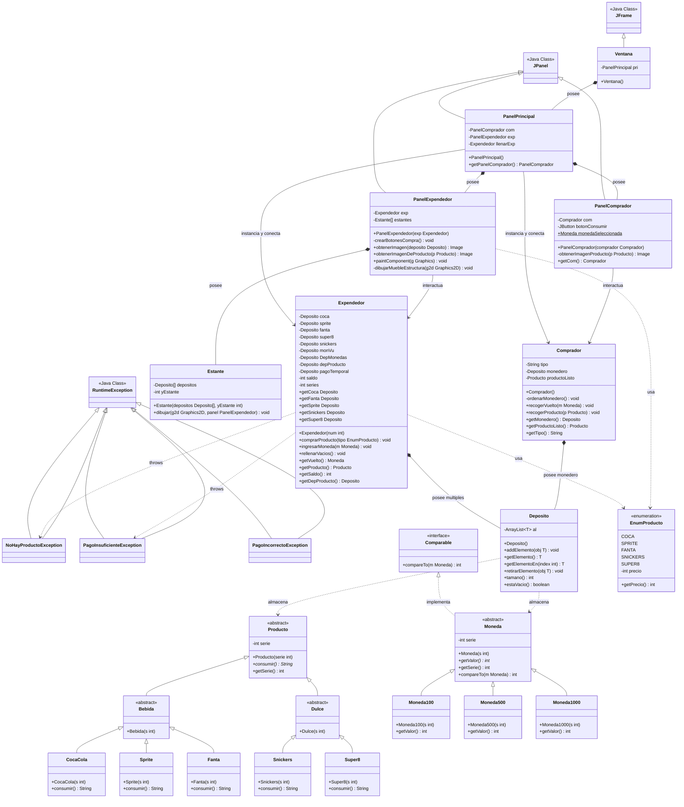

# Tarea3
Integrantes:
Javiera Antonia Diaz Grandon 
Tomas Ignacio Pizarro Abarca
Pablo Sebastian Bascuñan Espina

### Para ejecutar el proyecto:
1. Clonar el repositorio.
2. Abrir el proyecto en un IDE (intelliJ IDEA recomendado).
3. Configurar el SDK (java 17 o superior).
4. Ejecutar la clase "Main" ubicada en "src/main/java/org/Main.java".

### Funcionamiento:

1.La maquina expendedora puede recibir las monedas presionandolas e insertandolas en la ranura de una en una para realizar la comprar.
2.Posterior a la seleccion del producto si el saldo fue suficiente, se entregara el producto en la ranura para que el cliente pueda recoger la compra.
3.Luego de que recoja la compra, el cliente puede consumir su producto o hacer otra compra.

El **diagrama UML** se completo mediante las herramientas de git:

### Diagrama principal

